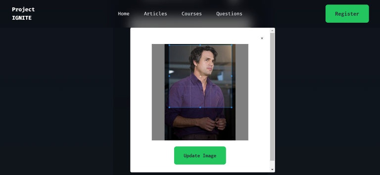

# Project IGNITE

A Learning Management System (LMS) designed for programmers. Made using Node.js, Express.js, React.js, and MongoDB.

## Table of Contents

- [Demo](#demo)
  - [Screenshots](#screenshots)
- [Features](#features)
- [Technologies Used](#technologies-used)
- [Running the Project Locally](#running-the-project-locally)

## Demo

You can check out the live demo of Project IGNITE [here](https://project-ignite-client.vercel.app/).

### Screenshots





## Features

- Access, create, update, and delete learning resources like articles, questions, courses
- User authentication and role-based access to certain features
  - Login using Access Tokens
- Images crop and upload
- Markdown Editor and Markdown Viewer
- Video Player

## Technologies Used

### Frontend

- [React](https://react.dev/)
- [TailwindCSS](https://tailwindcss.com/) for styling
- [Axios](https://axios-http.com/docs/intro)
- [Redux Toolkit (RTK)](https://redux-toolkit.js.org/)
- [Redux Persist](https://redux-toolkit.js.org/rtk-query/usage/persistence-and-rehydration)
- [React MD Editor](https://uiwjs.github.io/react-md-editor/)
- [React Cropper](https://react-cropper.github.io/react-cropper/)

### Backend

- [Express.js](https://expressjs.com/)
- [Node.js](https://nodejs.org/en/about)
- [Mongoose](https://mongoosejs.com/)
- [JSON Web Tokens (JWT)](https://jwt.io/)
- [Bcrypt](https://www.npmjs.com/package/bcrypt)
- [Multer](https://www.npmjs.com/package/multer)
- [Cloudinary](https://cloudinary.com/documentation)

## Running the Project Locally

These instructions will help you set up a copy of the project on your local machine.

### Prerequisites

Before getting started, make sure you have Node.js and npm (Node Package Manager) installed on your machine. This project requires Node.js version 18.15.0 or higher.

### Installing & Usage

1. Clone the repository to your local machine:

   ```bash
   git clone https://github.com/Krishnanand2517/project-ignite
   ```

1. Navigate to the backend directory & install the project dependencies:

   ```bash
   cd server
   npm install
   ```

1. Copy the environment variables to a new file `.env`:

   ```bash
   cp .env.sample .env
   ```

   Obtain the values and API keys for the variables from their respective sources.

1. Once you have installed the project and its dependencies, you can run the development server:

   ```bash
   npm run dev
   ```

   This will start the backend server on port 3001, and you can access it in your web browser at http://localhost:3001/.

1. Navigate to the frontend directory and install project dependencies:

   ```bash
   cd ..
   cd frontend
   npm install
   ```

1. Run the development server for frontend:

   ```bash
   npm run dev
   ```

   This will start the frontend server on port 5173, and you can access the web app in your web browser at http://localhost:5173/

### Contribute

If you encounter any issues, have suggestions, or want to contribute, feel free to open an issue or submit a pull request. Happy coding!
